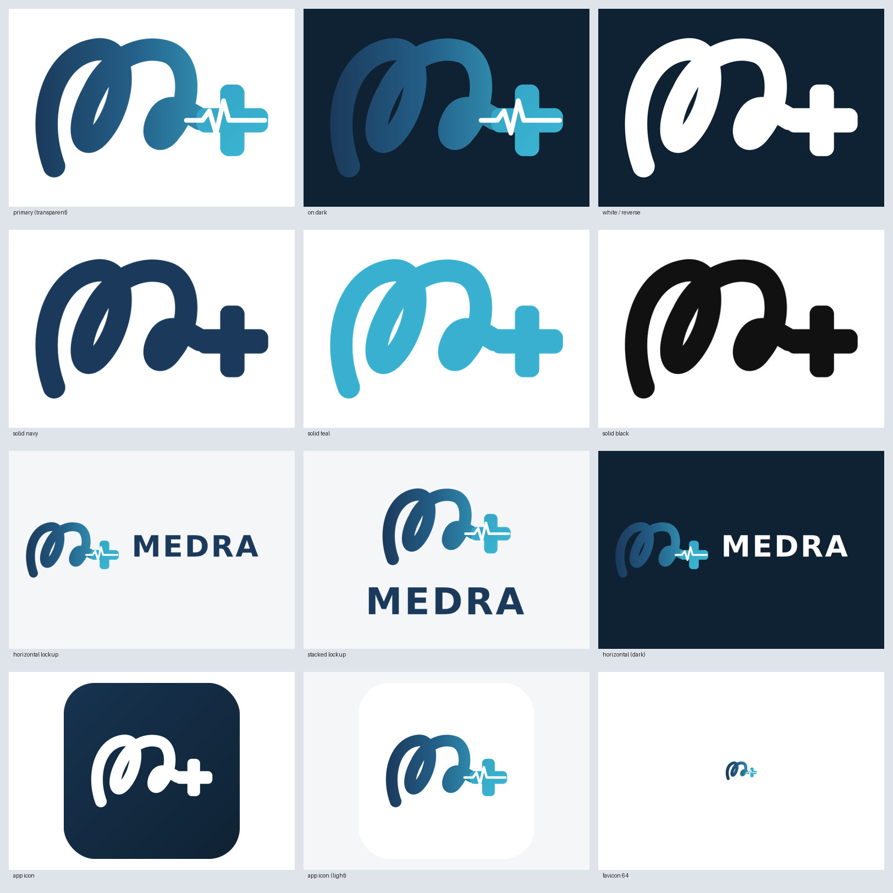

# Medra — Logo & Brand Assets

Vector-first logo system rebuilt as clean SVG so the mark reproduces with **no loss of
detail at any size**, with PNG exports for convenience. The mark is a single flowing script
**"M"** (navy→teal gradient ribbon) ending in a rounded **medical cross** with an **ECG
heartbeat** pulse.



## Files

### Master mark — `brand/svg/`
| File | Use |
|---|---|
| `medra-logo-primary.svg` | **Primary** full-gradient mark, transparent background |
| `medra-logo-primary-onwhite.svg` | Primary on a white plate |
| `medra-logo-primary-ondark.svg` | Primary on the dark brand background |
| `medra-logo-white.svg` | All-white (reverse) — for dark/photographic backgrounds |
| `medra-logo-white-ondark.svg` | Reverse shown on the dark brand background |
| `medra-logo-navy.svg` | Single-colour navy |
| `medra-logo-teal.svg` | Single-colour teal |
| `medra-logo-black.svg` | Single-colour black (mono print/fax/stamp) |

### Wordmark lockups
| File | Use |
|---|---|
| `medra-lockup-horizontal.svg` | Mark + **MEDRA** side by side (light backgrounds) |
| `medra-lockup-horizontal-dark.svg` | Horizontal lockup on dark |
| `medra-lockup-stacked.svg` | Mark above **MEDRA** (light) |
| `medra-lockup-stacked-dark.svg` | Stacked lockup on dark |

### Icons
| File | Use |
|---|---|
| `medra-appicon.svg` | App icon — white mark on dark rounded square |
| `medra-appicon-light.svg` | App icon — gradient mark on white rounded square |
| `medra-favicon.svg` | Favicon source |

### PNG exports — `brand/png/`
Transparent PNGs at multiple widths (e.g. `-1200`, `-512`), app icons at `-1024`/`-512`,
and favicons at `16, 32, 48, 64, 128, 256 px`. `medra-logo-overview.png` is the contact
sheet above.

## Colour palette

| Token | Hex | Use |
|---|---|---|
| Navy (deep) | `#1b3a5b` | Ribbon start, wordmark, dark UI text |
| Blue (mid) | `#245f88` | Gradient midpoint |
| Blue (light) | `#2f8bac` | Gradient |
| Teal | `#39b0cf` | Ribbon end, cross, accents |
| Dark background | `#0f2233` | Reverse/app-icon backgrounds |
| Pulse | `#ffffff` | ECG heartbeat line (knocked out in mono marks) |

Ribbon gradient runs **navy → teal, left → right**. In single-colour marks the heartbeat is
rendered as **negative space** (knockout) so it reads on any background.

## Usage guidelines

- **Clear space:** keep padding around the mark of at least the height of the cross on all sides.
- **Minimum size:** use the **app-icon** (not the full mark) below ~32 px; the script detail
  muddies at very small sizes.
- **Backgrounds:** use the gradient/navy/teal marks on light backgrounds; use the **white**
  mark on dark or busy photographic backgrounds.
- **Don't:** recolour outside the palette, stretch/skew, add drop shadows, rotate, or re-order
  the gradient.

## Regenerating

All assets are produced from one script (parametric — edit once, re-export everything):

```
python3 tools/logo/generate.py
```

> Note: the wordmark lockups set **MEDRA** in a bold geometric sans (DejaVu Sans / Arial
> fallback) via SVG `<text>`, so it stays editable. For final production hand-off, outline the
> text to paths in your vector editor to make the lockups fully font-independent.
