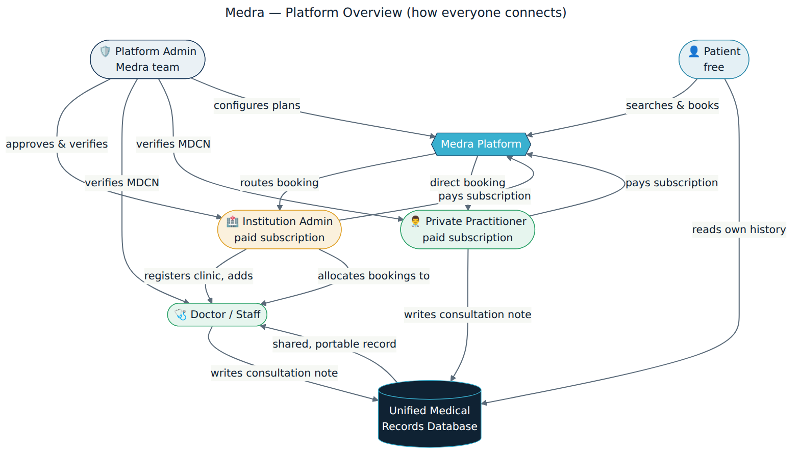
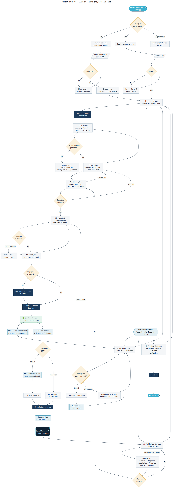
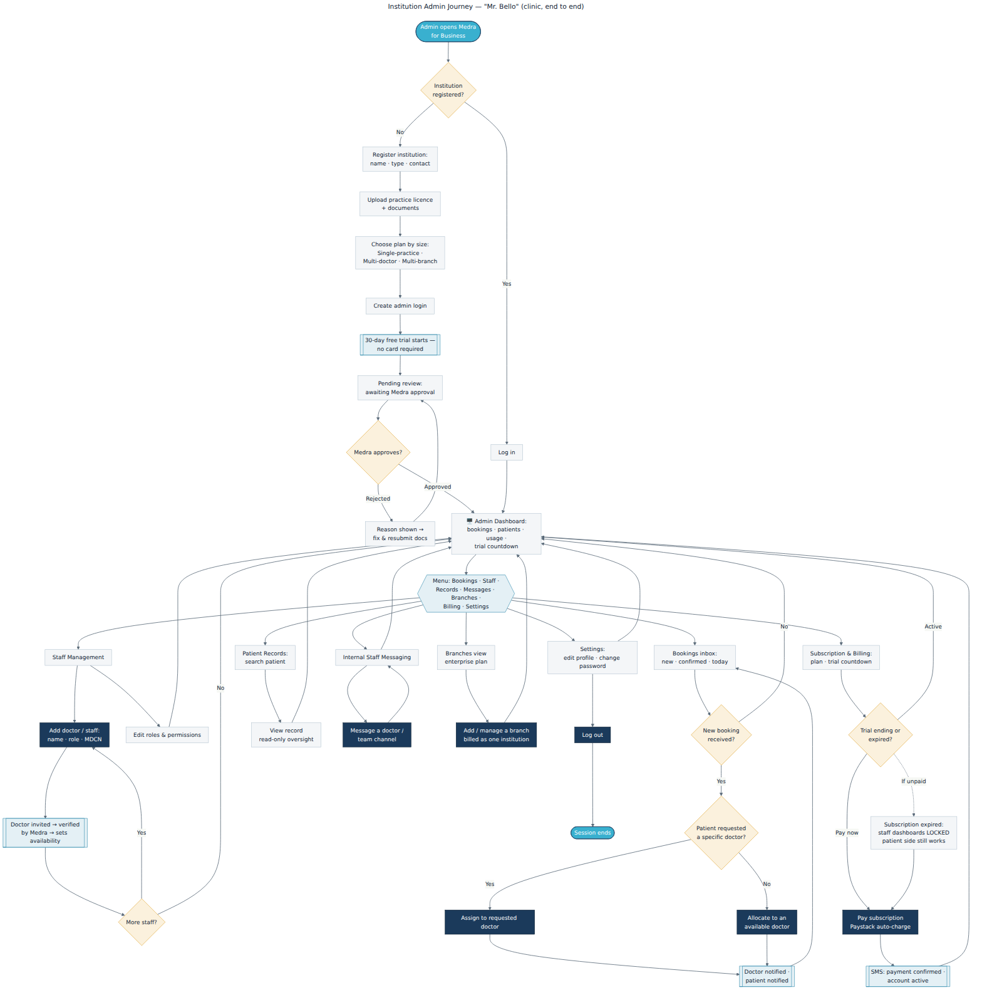
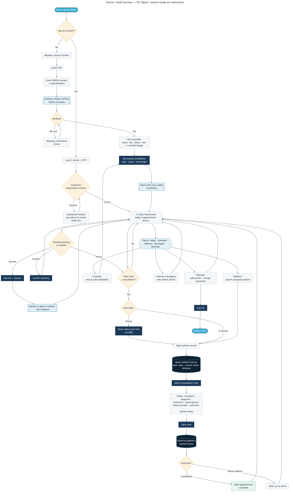
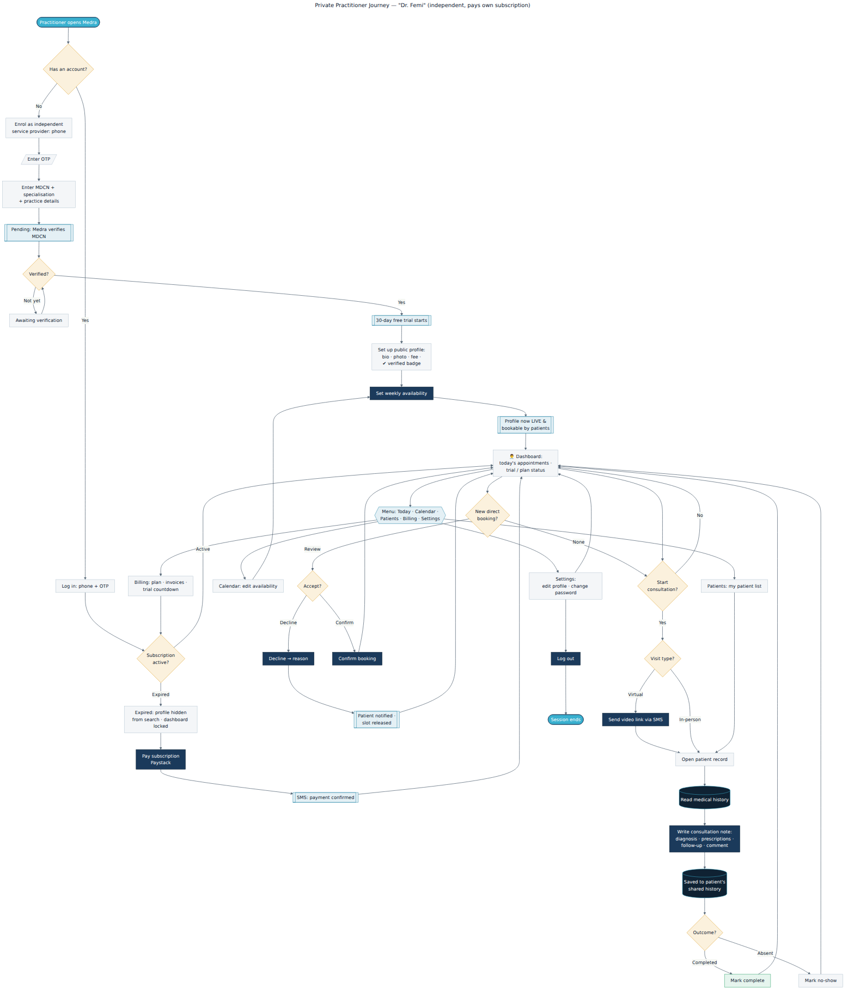
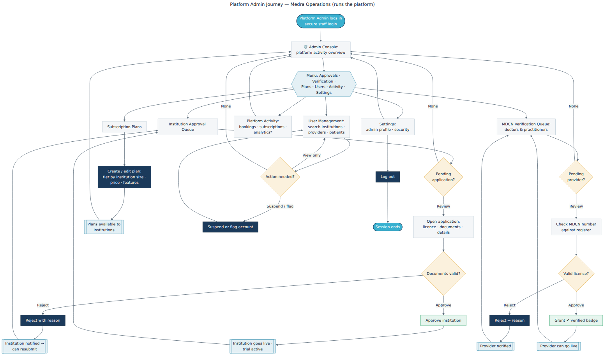

<p align="center"></p>

# Medra — User Journeys

Comprehensive, **plain-language** flowcharts of how each kind of person moves through Medra —
end to end, page by page, decision by decision. The goal: with only these diagrams, a
non-technical reader can understand how the platform works and how to navigate it. **Every
path has an entry and an exit — no dead ends, nothing left to assumption.**

- 🖥️ **Interactive version:** open [`medra-user-journeys.html`](medra-user-journeys.html) in a
  browser (or the published Artifact) — brand-styled, with a colour key and jump navigation.
- ✍️ **Editable source:** each journey is a [Mermaid](https://mermaid.js.org/) `.mmd` file — edit
  the text, re-render, done.

## Colour key

| Colour | Meaning |
|---|---|
| 🟦 Teal | Start / End of a session |
| ⬜ Light | A screen or page the user sees |
| 🟦 Navy | An action the user takes (tap, submit) |
| 🟨 Amber | A decision / branch (yes ↔ no) |
| 🟦 Blue | System / automatic step (SMS, notification) |
| ⬛ Dark | Data saved to the medical record |
| 🟩 Green | A completed outcome |

---

## 0 · How the whole platform connects
Start here — how the five roles interconnect through the shared records database.



## 1 · Patient — "Amara"
Sign up → find a verified doctor → book before leaving home → reminders → attend (in‑person or
video) → read the doctor's notes in a personal history.



## 2 · Institution Admin — "Mr. Bello"
Register the clinic → get approved → run bookings, staff, records, messaging, branches and
billing from one dashboard.



## 3 · Doctor / Staff — "Dr. Ngozi"
Register with MDCN → get verified → set availability → work the daily queue → write consultation
notes → complete or no-show.



## 4 · Private Practitioner — "Dr. Femi"
Independent provider — same care flow as a doctor, plus their own subscription that keeps their
public profile bookable.



## 5 · Platform Admin — Medra Operations
Approve institutions, verify every MDCN licence, configure plans, and oversee activity.



---

### Re-rendering
```bash
# needs @mermaid-js/mermaid-cli (mmdc)
for f in docs/journeys/*.mmd; do
  mmdc -i "$f" -o "docs/journeys/img/$(basename "${f%.mmd}").png" -b white -s 2
done
```
